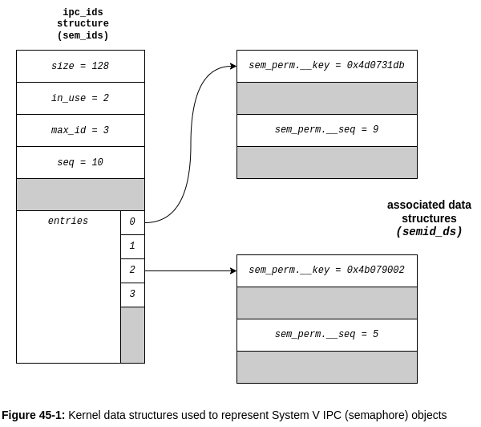

# 45 Introduction to System V IPC

System V IPC is the label used to refer to three different mechanimss for
interporcess communication:

* **Message queues** : can be used to pass messages between processes. Somewhat
  lile pipes, but differs in two important respects: First, message boundaries
  are preserved, so that readers and writers communicate in units of messages,
  rather than via undelimited byte stream. Second, each message includes an
  integer *type* field, and it is possible to select messages by type, rathern
  than reading them inthe order in which they were written.

* **Semaphores** : permit multiple processes to synchronize their actions. A
  semaphore is a kernel-maintained integer value that is visible to all
  processes that have the necessary permissions. A process indicates to its
  peers that it is performing some action by making an appropriate modification
  to the value of the semaphore.

* **Shared memory** : enables processes to share the same region (called
  segment) of memory (i.e., the same page frames are mapped into the virtual
  memory of multiple processes). Since access to user-space memory is a fast
  operation, shared memory is one of the quickest methods of IPC: once one
  process has updated the shared memory, the change is immediately visible to
  ther processes sharing the same segment.

This chapter provides an overview of the System V IPC mechanisms and details of
those features that are common to all three mechanisms. The tree mechanisms are
then discussed individually in the following chapters.

## 45.1 API Overview

Table 45-1 summarizes the header files and system calls used for working with
System V IPC objects.

### Table 45-1

| Interface           | Message queues                    | Semaphores    | Shared memory                  |
|:------------------- |:----------------------------------|:--------------|:-------------------------------|
| Header file         | <sys/msg.h>                       | <sys/sem.h>   | <sys/shm.h>                    |
| Associated data     | msqid_ds                          | semid_ds      | shmid_ds                       |
| Create/open objects | msgget()                          | semget()      | shmget() + shmat()             |
| Close object        | (none)                            | (none)        | shmdt()                        |
| Control operations  | msgctl()                          | semctl()      | shmctl()                       |
| Performance IPC     | msgsnd() - write, msgrcv() - read | semop() -test | access memory in shared region |

### Creating and opening a System V IPC object

Each System V IPC mechanism has an associated *get* system call (*msgget()*,
*segmet()*, *shmget()*), which is analogous to the *open()* system call used
for files. Given an interger *key* (analogous to filename), the *get* call
either:

* **creates** a new IPC object with the given key and returns a unique
  identifier for that object;

* **returns** the identifier of an existing IPC object with the given key.

We'll (loosely) term the second use *opening* an existing IPC object. In this
case, all that the *get* call is doing is converting one number (the key) into
another number (the identifier).

An IPC *identifier* is analogous toa file descriptor in that it is used in all
subsequent system calls to refer to the IPC object. There is, however, an
important semantic difference. Whereas a file descriptor is a process
attribute, and IPC identifier is a property of the object itself and is visible
**system-wide**. All processes accessing the same object use the same
identifier.  This means that if we know an IPC object already exists, we can
skip the *get* call, provided we have some other means of knowing the
identifier of the object. For example, the process that created the object
might write the identifier ot a file tha can then be read by other porocesses.

The following example shows how to create a System V message queue:

```c
id = msgget(key, IPC_CREAT | S_IRUSR | S_IWUSR);
if (id == -1) {
  perror("msgget");
  exit(EXIT_FAILURE);
}
```

As with all of the *get* calls, the key is the first argument, and the
identifier is returned as the function result. We specify the permissions to be
placed on the new object as part of the final (*flags*) argument to the *get*
call, using the same bit-mask constants as usef for files. In the above
example, permission is granted to just the owner of the object to read and
write messages on the queue.

The process umask is not applied to the permissions placed on a newly created
IPC object. Each process that wants to access the same IPC object performs a
*get* call specifying the same key in order to obtain the same identifier for
that object. We consider how to choose a key for an application in [Section
45.2](#452-ipc-keys).

If no IPC object corresponding to the given key currently exists, and
`IPC_CREAT` (analogous to the `open() O_CREAT` flag) was specified as part of
the *flags* argument, then the *get* call creates a new IPC object. If no
corresponding IPC object currently exists, and `IPC_CREAT` was not specified
(and the key was not specified as `IPC_PRIVATE`, as described in [Section
45.2](#452-ipc-keys)), then the *get* call fails with the error `ENOENT`.

A process can guarantee that it is the one creating an IPC object by specifying
the `IPC_EXCL` flag (analogous to the `open() O_EXCL` flag). If `IPC_EXCL` is
specified and the IPC object corresponding to the given key already exists,
then the *get* call fails with the error `EEXIST`.

### IPC object deletion and object persistence

The *ctl* system call (*msgctl(), semctl(), shmctl()*) for each System V IPC
mechanism performs a range fo *control operations* for the object. Many of
these operations are specific to the particular IPC mechanism, but a few are
generic to all IPC mechanisms. An example of a generic control operation is
`IPC_RMID`, which is used to delete an object. For example, we can use the
following call to delete a shared memory object:

```c
if (shmctl(id, IPC_RMID, NULL) == -1) {
  perror("shmctl");
  exit(EXIT_FAILURE);
}
```

For message queues and semaphores, deletion of the IPC object is immediate, and
any informaiton contained within the object is destroyed, regardless of whether
any other process is still using the object. (This is one of a number of points
where the operation of System V IPC objects is not analogous to files. In
[Section 18.3](#nop), we saw that if we remove the last link to a file, then
the file is actually removed only after all open file descriptors referring to
it have been closed.)

Deletion of shared memory objects occurs differently. Following the *shmctl(
id, IPC_RMID, NULL)* call, the shared memory segment is removed only after all
processes using the segment detach it (suing *shmdt()*). (This is much closer
to the situation with file deletion.)

System V IPC objects have kernel persistence. Once created, an object continues
to exist until it is explicitly deleted or the system is shut down. This
property of System V IPC objects can be advantageous. It is possible for a
process to create an object, modify its state, and then exit, leaving the
object to be accessed by some process that is started at a later time. It can
also be disadvantageous for the following reasons:

* There are system-imposed limits on the number of IPC objects of each type. If
  we fail to remove unused objects, we may eventually encounter appliaton
  errors as a result of reaching these limits.

* When deleting a message queue or semaphore object, a multiprocess application
  may not be able to easily determine which will be the last process requiring
  access to the object, and thus when the object can be safely deleted. The
  problem is that these objects are *connectionless* -- the kernel doesn't keep
  a recored of which process have the object open. (This disadvantage doesn't
  apply for shared memory segments, because of their different deletion
  semantis, describied above.)

## 45.2 IPC Keys

System V IPC keys are integer values represented using the data type *key_t*.
The IPC *get* calls translate a key into the corresponding integer IPC
identifier.  These calls guarantee that if we create a new IPC object, then
that object will have a unique identifier, and that if we specifi the key of an
existing object, then we'll always obtain the (same) identifier for that
object. (Internally, the kernel maintains data structures mapping keps to
identifiers for each IPC mechanism, as described in [Section
45.5.](#algorithm-employed-by-system-v-ipc-get-calls))

So, how do we provide a unique key -- one that guarantees that we won't
accidentally obtain the identifier of an existing IPC object used by some other
application?  There are three possibilities:

* Randomly choose some integer key value, which is typically placed in a header
  file inclded by all programs using the IPC object. The difficulty with this
  approach is that we may accidentally choose a value used by another
  application.

* Specify the `IPC_PRIVATE` constant as the *key* value to the *get* call when
  creating the IPC object, which always results in the creation of a new IPC
  object that guaranteed to have a unique identifier.

* Employ the *ftok()* function to generate a (likely unique) key.

Using either `IPC_PRIVATE` or *ftok()* is the usual technique.

### Generating a unique identifier with `IPC_PRIVATE`

When creating a new IPC object, the key may be specified as `IPC_PRIVATE`, as
follows:

```c
int id = msgget(IPC_PRIVATE, S_IRUSR | S_IWUSR);
```

In this case, it is not necessary to specify the `IPC_CREATE` or `IPC_EXCL`
flags.

This technique is especially useful in multiprocess applications where the
parent process creates the IPC object prior to performing a *fork()*, with the
result that the child inherits the identifier of the IPC object. We can also
use this technique in client-server applications (i.e., those involving
unrelated processes), but the clients must have a means of obtaining the
identifiers of the IPC objects created by the server (and vice versa). For
example, after creating an IPC object, the server could then write its
identifier to a file that can be read by clients.

### Generating a unique key with *ftok()*

The *ftok()* (*file to key*) function returns a key value suitable for use in a
subsequent call to one of the System V IPC *get* system calls.

```c
#include <sys/ipc.h>

/**
 * Returns integer key on success, or -1 on error
 /
key_t ftok(char* pathname, int proj);
```

This key value is generated from the supplied *pathname* and *proj* value using
an implementation-defined algorithm. SUSv3 makes the following requirements:

* Only the least significant 8 bits of *proj* are employed by the algorithm.

* The application must ensure that the *pathname* refers to an existing file to
  which *stat()* can be applied (otherwise, *ftok()* returns -1).

* If different pathnames (links) referring to the same file (i.e., i-node) are
  supplied to *ftok()* with the same *proj* value, the same key value must be
  returned.

To put things another way, *ftok()* uses the i-node number rather that the name
of the file to generate the key value. (Because the *ftok()* algorithm depends
on the i-node number, the file should not be removed and re-created during the
life of the application, since it is likely that the file will be re-created
with a different i-node number.) The purpose of the *proj* value is simpley to
allow us to generate multiple keys from the same file, which is useful when an
application needs to create multiple IPC objects of the same type.
Historically, the *proj* argument was of tyep *char*, and it is often specified
as such in calls to *ftok()*.

Normally, the *pathname* given to *ftok()* referes to one of the files or
directories that forms part of, or is created by, the application, and
cooperating processes pass the same *pathname* to *ftok()*.

On Linux, the key returned by *ftok()* is a 32-bit value, created by taking the
least significant 8 bits from the *proj* argument, the least significant 8 bits
of the device number (i.e., the minor device number) of the device containing
the file system in which the file resides, and the least significant 16 bits of
the i-node number of the file referred to by *pathname*. (The last two pieces
of information are obtained by calling *stat()* on *pathname*.)

The *glibc ftok()* algorithm is similar to that employed on other UNIX
implementations, and suffers a similar limitation: there is a (very small)
possibility that two different files could yield the same key value. This can
occur because there is a chance that the least significant bits of an i-node
number could be the same for two files on different file systems, coupled with
the possibility that two different disk devices (on a system with multiple
disks controllers) could have the same minor device number. However, in
practice, the possibility of colliding key values for different applications is
small enough that the use of *ftok()* for key generation is a viable technique.

A typical usage of *ftok()* is the following:

```c
key_t key = ftok("/mydir/myfile", 'x');
if (key == -1) {
  perror("ftok");
  exit(EXIT_FAILURE);
}

int id = msgget(key, IPC_CREAT | S_IRUSR | S_IWUSR);
if (id == -1) {
  perror("msgget");
  exit(EXIT_FAILURE);
}
```


## 45.3 Associated Data Structure and Object Permissions

The kernel maintains an associated data structure for each instance of a System
V IPC object. The form of this data structure varies according to the IPC
mechanism (message queue, semaphore, or shared memory) and is defined in the
corresponding header file ofr the IPC mechanism (see [Table
45-1](#table-45-1)). We discuss mechanism-specific details of each of these
data structures in the following chapters.

The associated data structure for an IPC object is initialized when the object
is created via the appropriate *get* system call. Once the object has been
created, a program can obtain a copy of this data structure using the
appropriate *ctl* system call, by specifying an operation type of `IPC_STAT`.
Conversely, some parts of the data structure can be modified using the
`IPC_SET` operation.

As well as data specific to the type of IPC object, the associated data
structure for all three IPC mechanisms includes a substructure, *ipc_perm*,
that holds information used to determine permissions granted on the object:

```c
struct ipc_perm {
  key_t __key; // Key, as supplied to 'get' call
  uid_t uid;   // Owner's user ID
  gid_t gid;   // Owner's group ID
  uid_t cuid;  // Creator's user ID
  git_t cgid;  // Creator's group ID
  unsigned short mode;  // Permissions
  unsigned short __seq; // Sequence number
};
```

SUSv3 mandates all of the *ipc_perm* fields shown here, except *__key* and
*__seq*. However, most UNIX implementations provide some version of these
fields.

The *uid* and *gid* fields specify the ownership of the IPC object. The *cuid*
and *guid* fields hold th user and group IDs of the process that created the
object. Initially, the corresponding user and creator fields have the same
values, which are taken from the effective IDs of the calling processes. The
creator IDs are immutable, but the owner IDs can be changed via the `IPC_SET`
operation. The following code demonstrates how to change the *uid* field for a
shared memory segment (the associated data structure is of type *shmid_ds*):

```c
struct shmid_ds shmds;

// IPC_STAT
if (shmctl(id, IPC_STAT, &shmds) == -1) { /* Fetch from kernel */
  perror("shmctl");
  exit(EXIT_FAILURE);
}

// IPC_SET
shmds.shm_perm.uid = newuid;  /* Change owner UID */
if (shmctl(id, IPC_SET, &shmds) == -1) { /* Update kernel copy */
  perror("shmctl");
  exit(EXIT_FAILURE);
}
```

The *mode* field of the *ipc_perm* substructure holds the permissions mask for
the IPC object. These permissions are initialized using the lower 9 bits of the
*flags* specified in the *get* system call used to create the object, but can
be changed subsequently using the `IPC_SET` operation.

As with files, permissions are broken into three categories -- *owner* (also
known as *user*), *group*, and *other* -- and it is possible to specify
different permissions for each category. There are, however, some notable
differences from the scheme used for files:

* Only read and write permissions are meaningful for IPC objects. (For
  semaphores, write permission is commonly referred to as *alter* permission.)
  Execute permission is meaningless, and is ignored when performing most access
  checks.

* Permission checks are made according to a process's effective user ID,
  effective group IDs, and supplementary group IDs. (This contrasts with
  file-system permission chjecks on Linux, which are perfomred using the
  process's file-system IDs, as described in [Section 9.5.](#noop)

The precise rules governing the permissions a process is granted on an IPC
object are as follows:

1. If the process is privileged (`CAP_IPC_OWNER`), then all permissions are
   granted on the IPC object.

2. If the effective user ID of the process matches either the owner or the
   creator user ID of the IPC object, then the process is granted the
   permissions defined for the *owner (user)* of the object.

3. If the effective ID or any of the supplementary group IDs of the process
   match either the owner group ID or the creator group ID of the IPC object,
   then the process is granted the *group* permissions defined for the object.

4. Otherwise, the process is granted the permissions defined for *other*.

How read and write permissions are intepreted for an object, and whether they are
required, depend on the type of the object and on the operation being performed.

When a *get* call is performed to obtain the identifier of an existing IPC
object, an initial permission check is made to ascertain whether the
permissions specified in the *flags* argument are compatiable with those on the
existing object. If not, then the *get* call fails with the error `EACCES`.
(Except as otherwise noted, this error ocde is also returned when permissions
are defined in each of the cases listed below.) To illustrate, conside the
example of two different users in the same group, with one user creating a
message queue using the following call:

```c
msgget(key, IPC_CREAT | S_IRUSER | S_IWUSER | S_IRGRP); // rw-r----
```

An attempt by the second user to obtain an identifier for this message queue
using the following call would fail, since the user is not permitted write
access to the message queue:

```c
msgget(key, S_IRUSR | S_IWUSR);
```

This second user could bypass this check by specifying 0 for the second
argument of the *msgget()* call, in which case an error would occur only when
the program attempted an operation requiring write permission on the IPC object
(e.g., writing a messagewith *msgsnd()*).

The permissions required for other common operations are as follows:

* To retrieve information from the object (e.g., to read a message from a
  message queue, obtain the value of a semaphore, or attach a shared memory
  segment for read access) requires read permission.

* To update information within the object (e.g., to write a message to a
  message queue, change the value of a semaphore, or attach a shared memory
  segment for write access) requires write permission.

* To obtain a copy of the associated data structure for an IPC object (the
  `IPC_STAT` *ctl* operation) requires read permission.

* To remove an IPC object (the `IPC_RMID` *ctl* operation) or change its
  associated data structure (the `IPC_SET` *ctl* operation) requires neither
  read nor write permission.  Rather, the calling process must either be
  privileged (`CAP_SYS_ADMIN`) or have an effective user ID matching either the
  owner user ID or the creator user ID of the object (otherwise, the error
  `EPERM` results).


Various other mechanism-specific operations require read or write permission,
or the `CAP_IPC_OWNER` capability. We note the required permissions in the
following chapters as the operations are described.


## 45.4 IPC Identifiers and Client-Server Applications

In client-server applications, the server typically creates the System V IPC
objects, while the client simply accesses them. In other words, the server
performs an IPC *get* call specifying the flag `IPC_CREAT`, while the client
omits this flag in its *get* call.

Suppose a client engages in an extended dialogue with a server, with multiple
IPC operations being performed by each process (e.g., multiple messages
exchanged, a sequence of semaphore operations, or multiple updates to shared
memory). What happens if the server process crashes or is deliberately halted
and then restarted? At this point, it would make no sense to blindly reuse the
existing IPC object created by the prevous server process, since the new server
process has no knowledge of the historical information associated with the
current state of the IPC object. (For example, there may be a secondary request
within a message queue that was sent by a client in response to an earlier
message from the old server process.)

In such a scenario, the only option for the server may be to abandon all
existing clients, delete the IPC objects created by the previous process, and
create new instances of the IPC objects. A newly started server handles the
possibility that a previous instance of the server terminated prematurely by
first trying to create an IPC object by specifying both the `IPC_CREAT` and the
`IPC_EXCL` flags within the *get* call. If the *get* call fails because an
object with the specified key already exists, then the server assumes the
object was created by an old server process; it therefore uses the `IPC_RMID`
*ctl* operation to delete the object, and once more performs a *get* call to
create the object.  (This may be combined with other steps to ensure that
another server process is not currently running, such as those described in
[Section 55.6.](#noop)) For a message queue, these steps might appear as shown
in [Listing 45-1](#listing-45-1-cleanup-of-ipc-objects-within-a-server).

### Listing 45-1: Cleanup of IPC objects within a server

```c
#include <cstdlib>
#include <sys/types.h>
#include <sys/ipc.h>
#include <sys/msg.h>
#include <sys/stat.h>

#define KEY_FILE "/some-path/some-file"  // should be an existing file or
                                         // one this program creates

int
main(int argc, char* argv[])
{
  int msqid;
  key_t key;
  const int MQ_PERMS = S_IRUSR | S_IWUSR | S_IWGRP; // rw--w----

  // Pptional code here to check if anotehr server process is already running

  // Generater the key for the message queue

  key = ftok(KEY_FILE, 1);
  if (key == -1) {
    perror("ftok");
    return EXIT_FAILURE;
  }

  // While msgget() fails, try creating the queue exclusively
  while ((msqid = msgget(key, IPC_CREAT | IPC_EXCL | MQ_PERMS)) == -1) {
    if (errno == EEXIST) { /* MQ with the same key already exists */
      msqid = msgget(key, 0);
      if (mdqid == -1) {
        perror("msgget() failed to retrieve old queue ID");
        return EXIT_FAILURE;
      }

      if (msgctl(msqid, IPC_RMID, NULL) == -1) {
        perror("msgctl() failed to delete old queue");
        return EXIT_FAILURE;
      }

      printf("Removed old message queue (id = %d)\n", msqid);
    } else {
      // Some other error give up
      perror("msgget failed");
      return EXIT_FAILURE;
    }
  }

  /**
   * Upon loop exit, we've successfully created the message queue,
   * and we can then carry on to do other work...
   */

  return EXIT_SUCCESS;
}
```

Even if a restarted server re-created the IPC objects, there still would be a
potentail problem if supplying the same key to the *get* call always generated
the same identifier whenever a new IPC object was created. Consider the
solution just outlined from the point of view of the client. If the IPC objects
re-created by the server use the same identifiers, then the client would have
no way of becoming aware that the server has been restarted and that the IPC
objects don't contain the expected historical information.

To solve this problem, the kernel employs an algorithm (described in the next
section) that normally ensures that when a new IPC object is created, the
object's identifier will be different, even when the same key is supplied.
Consequently, any clients of the old server process that attempt to use the old
identifier will receive an error from the relevant IPC system call.


## 45.5 Algorithm Employed by System V IPC *get* Calls

[Figure 45-1](#noop) shows some of the structures used internally by the kernel
to represent informartion about System V IPC objects (in this case semaphores,
but the details are similar for other IPC mechanisms), including the fields
used to calculate IPC keys. For each IPC mechanism (shared memory, messsage
queue, or semaphore), the kernel maintains an associated *ipc_ids* structure
that records various global information about all instances of that IPC
mechanism.  This information includes a dynamically sized array of pointers,
*entries*, to the associated data structure for each object instance
(*semid_ds* structures in the case of semaphores). The current size of the
*entries* array is recorded in the *size* field, with *max_id* field holding
the index of the highest currently in-use element.



When an IPC *get* call is made, the algorithm used on Linux (other systems use
similar algorithms) is approximately as follows:

1. The list of associated data structures (pointed to by elements of the
   *entries* array) is searched for one whose *key* field matches that
   specified in the *get* call.

   a) If no match is found, and `IPC_CREAT` was not specified, then the error
      `ENOENT` is returned.

   b) If a match is found, but both `IPC_CREAT` and `IPC_EXCL` were specified,
      then the error `EEXIST` is returned.

   c) Otherwise, if a match is found, then the following step is skipped.


2. If no match was found, and `IPC_CREAT` was specified, then a new mechanism-
   specific associated data structure (*semid_ds* if [Figure 45-1](#noop)) is
   allocated and initialized. This also involves updating various fields of the
   *ipc_ids* structure, and many involve resizing the *entries* array. A
   pointer to the new structure is placed in the first free element of
   *entries*. Two substeps are included as part of this initialization:

   a) The *key* value supplied in the *get* call is copied into the
      *xxx_perm.__key* field of the newly allocated structure.

   b) The current value of the *seq* field of the *ipc_ids* structure is copied
      into the *xxx_perm.__seq* field of the associated data structure, and the
      *seq* field is incremented by one.

3. The identifier for the IPC object is calculated using the following formula:

```c
identifier = index + xxx_perm.__seq x SEQ_MULTIPLIER;
```

In the formula used to calculate the IPC identifier, *index* is the index of
this object instance within the *entries* array, and `SEQ_MULTIPLIER` is a
constant defined with the value 32,7678 (`IPCMNI` in kernel source file
`include/linux/ipc.h`). For example, in [Figure 45-1](#noop), the identifier
generated for the semaphore with the *key* value of `ox4b079002` would be `(2 +
5 x 32,768) = 163,842`.

Note the following points about the algorithm employed by the *get* calls:

* Even if a new IPC object is created with the same key, it will almost
  certainly have a different identifier, since the identifier is calculated
  based on the *seq* value saved in the associated data structure, and this
  value is incremented by one during the creation of each object of this type.

* The algorithm generates a distinct set of identifier values for each index of
  the *entries* array.

* SInce the constant `IPCMNI` defines an upper limit on the number of System V
  objects of each type, the algorithm guarantees that each existing IPC object
  has a unique identifier.

* Given an identifier value, the corresponding index into the *entries* array
  can be quickly calculated using this equation:

  ```text
  index = identifier % SEQ_MULTIPLIER
  ```
  
  Being able to rapidly perform this calculation is necessary for the efficient
  operation of thos IPC system calls that are supplied with the identifier of
  those IPC object (i.e., those calls in [Table 45-1] other than the *get*
  calls).

In the passing, it is worth noting that two different errors can result if a
process makes an IPC system call (e.g., *msgctl()*, *semop()*, or *shmat()* )
that specifies an identifier that doesn't correspond to an existing object. If
the corresponding index of *entries* is empty, the error `EINVAL` results. If
the index points to an associated data structure, but the sequence number
stored in that structure doesn't yield the same identifier value, then it is
assumed that an old object pointed to by this array index has been deleted and
the index reused. This senario is diagnosed with the error `EIDRM`.


## 45.6 The *ipcs* and *ipcrm* Commands

The *ipcs* and *ipcrm* commands are the System V IPC analogs of the *ls* and
*rm* file commands. Using *ipcs*, we can obtain information about IPC objects
on the system. By default, *ipcs* displays all objects, as in the following
example:

```bash
$ ipcs

------ Message Queues --------
key        msqid      owner      perms      used-bytes   messages    

------ Shared Memory Segments --------
key        shmid      owner      perms      bytes      nattch     status      
0x00000000 4          mshasan    600        524288     2          dest         
0x00000000 163856     mshasan    600        524288     2          dest         
0x00000000 163872     mshasan    606        11206080   2          dest         
0x00000000 163873     mshasan    606        11206080   2          dest         

------ Semaphore Arrays --------
key        semid      owner      perms      nsems     
```

On Linux, *ipcs(1)* originally used the `IPC_STAT` *ctl* operation [Section
45.3](#453-associated-data-structure-and-object-permissions) so that it could
display information only about IPC objectgs for which we have read permission,
regardless of whether we own the objects. More recent versions of *ipcs* use
the `/proc/sysvipc` interfaces ([Section 45.7](#noop)) and can display all
objects, regardless of permissions.

By default, for each object, *ipcs* displays the key, the identifier, the
owner, and the permissions (expressed as an octal number), followed by
information specific to the object:

The *ipcrm* command deletes an IPC object. The general form of this command is
one of the following:

```bash
$ ipcrm -X key
$ ipcrm -x id
```

In the above, we either specify *key* as an IPC object key or *id* as an IPC
object identifier, and the letter *x* is replaced by an uppercase or lowercase
*q* (for message queues), *s* (for semaphores), or *m* (for shared memory).
Thus, we could use the following command to delete the semaphore set with the
identifier 65538:

```bash
$ ipcrm -s 65538
```


## 45.7 Obtaining a List of All IPC Objects

Linux provides two nonstandard methodsd of obtaining a list of all IPC objects
on the system:

* files within `/proc/sysvipc` directory that list all IPC objects; and 
* the use of Linux-specific *ctl* calls.

We describe the files in `/proc/sysvipc` directory here, and defer discussion
of the *ctl* calls until [Section 46.6](#noop), where we provide an example
program that lists all System V message queues on the system.

Three read-only files in the `/proc/sysvipc` directory provide the same 
information as can be obtained via `ipcs`:

* `/proc/sysvipc/msg` lists all messages queues and their attributes.
* `/proc/sysvipc/sem` lists all semaphore sets and their attributes.
* `/proc/sysvipc/shm` lists all shared memory segments and their attributes.

Unlike the *ipcs* command, these files always show all objects of the
corresponding type, regardless of whether read permission is available on the
objects.

An example of the contents of `/proc/sysvipc/sem` is the following:

```bash
$ cat /proc/sysvipc/shm

key      shmid perms     size  cpid  lpid  nattch       uid       gid      cuid      cgid      atime      dtime      ctime    rss    swap
  0          4  1600   524288  6539 833197      2 649398602 600260513 649398602 600260513 1713686029 1713686029 1713584920   4096       0
  0     163856  1600   524288 51833 878534      2 649398602 600260513 649398602 600260513 1713690262 1713690262 1713684470  16384       0
```


## 45.8 IPC Limits

Since System V IPC objects consume system resources, the kernel places various
limits on each class of IPC object in order to prevent resources from being
exhausted. The methods for placing limits on System V IPC objects are not
specified by SUSv3, but most UNIX implementations (including Linux) follow a
similar framework for the types of limits that may be placed. As we cover each
System V IPC mechanism in the following chapters, we discuss the associated
limits and note differences from other UNIX implementations.

Although the types of lmits that can be placed on each class of IPC object are
generally similar across various UNIX implementations, the methods of viewing
and changing these limits are not. The methods described in the following
chapters are Linux-specific (they generally involve the use of files in the
`/proc/sys/kernel` directory); things are done differently on other
implementations.

On Linux, the *ipcs -l* command can be used to list the limits on each of the
IPC mechanisms. Programs can employ the Linux-specific `IPC_INFO` *ctl*
operation to retrieve the same information.


## 45.9 Summary

System V IPC is the name given to three IPC mechanisms that first appeared
widely in System V, and have subsequently been ported to most UNIX
implementations and incorporated into various standards. The three IPC
mechanisms are message queues, which allow processes to exchange messages;
semaphores, which allow processes to synchronize access to shared resources;
and shared memory, which allows two or more processes to share the same page of
memory.

The three IPC mechanisms have many similarities in their APIs and semantics.
For each IPC mechanism, a *get* system call creates or opens an object. Given
an integer *key*, the *get* calls return an integer *identifier* used to refer
to the object in subsequent system calls. Each IPC mechanism also has a
corresponding *ctl* call that is used to delete an object and to retrieve and
modify various attributes (e.g., ownership and permissions) in an object's
associated data structure.

The algorithm used to generate identifiers for new IPC objects is designed to
minimize the possibility of the same identifier being (immediately) reused if
an object is deleted, even if the same key is used to create a new object. This
enables client-server applications to function correctly -- a restarted server
process is able to detect and remove IPC objects created by its predecessor,
and this action invalidates the identifiers held by any clients of the previous
server process.

The *ipcs* command lists the System V IPC objects that currently exist on the
system. The *ipcrm* command is used to remove System V IPC objects.

On Linux, files in the `/proc/sysvipc` directory can be used to obtain
information about all of the System V IPC objects on the system.

Each IPC mechanism has an associated set of limits that can be used to avoid
exhaustion of system resources by preventing the creation of an arbitrary
number of IPC objects. Various files under the `/proc/sys/kervel` directory can
be used to view and modify these limits.


