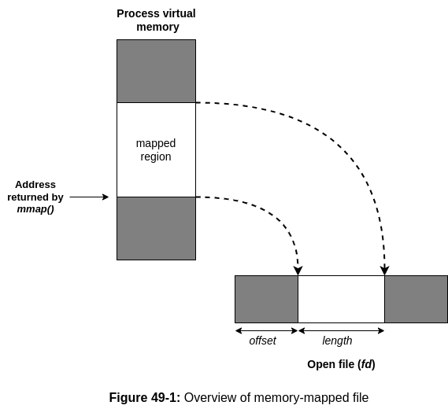

# 49 MEMORY MAPPINGS

## TOC

1. [Overview](#491-overview)
2. [Creating a Mapping: *mmap()*](#492-creating-a-mapping-mmap)
3. [Unmapping a Mapped Region: *munmap()*](#493-unmapping-a-mapped-region-munmap)
4. [File Mappings](#494-file-mappings)
   1. [Private File Mappings](#4941-private-file-mappings)
   2. [Shared File Mappings](#4942-shared-file-mappings)
   3. [Boundary Cases](#4943-boundary-cases)
   4. [Memory Protection and File Access Mode Interactions](#4944-memory-protection-and-file-access-mode-interactions)
5. [Synchronizing a Mapped Region: *msync()*](#495-synchronizing-a-mapped-region-msync)
6. [Additional *mmap()* Flags](#496-additional-mmap-flags)
7. [Anonymous Mappings](#497-anonymous-mappings)
8. [Remapping a Mapped Region: mremap()](#498-remapping-a-mapped-region-mremap)
9. [MMAP_NORESERVE and Swap Space Overcommitting](#499-mmap-noreserve-and-swap-space-overcommitting)
   1. [The MAP_FIXED Flag](#4910-the-map-fixed-flag)
   2. [Nonlinear Mappings: *remap_file_pages()*](#4911-nonlinear-mappings-remap-file-pages)
   3. [Summary](#4912-summary)

## 49.1 Overview

The *mmap()* system call creates a new *memory mapping* in the calling
process's virtual address space.  A mapping can be of two types:

* *File mapping*: A file mapping maps a region of a file directly into the
  calling process's virtual memory. Once a fils i mapped, its contents can be
  accessed by operations on the bytes in the corresponding memory region. The
  pages of the mapping are (automatically) loaded from the file as required.
  This type of mapping is also known as *file-based mapping* or *memory-mapped
  file*.

* *Anynomous mapping*: An anonymous mapping doesn't have a corresponding file.
  Instead, the pages of the mapping are initialzsed to 0.

The memory in one process's mapping may be shared with mappings in other
processes (i.e., the page-table entries of each process point tot he same pages
of RAM). This can occur in two ways:

* When two processes map the same region of a file, they share the same pages
  of physical memory.

* A child process created by *fork()* inherits copies of its parent's mappings,
  and these mappings refer to the same pages of physical memory as the
  corresponding mapping in the parent.

When two or more processes share the same pages, each process can potentially
see the changes to the page contents made by other processes, depending on
whether the mapping is *private* or *shared*:

* *private mapping* (`MAP_PRIVATE`): Modifications to the contents of the
  mapping are not visible to other processes and, for a file mapping, are not
  carried through to the underlying file. Although the pages of a private
  mapping are initially shared in the circumstances described above, changes ot
  the contents of the mapping are nevertheless private to each process. The
  kernel accomplishes this using the copy-on-write technique ([Section
  24.2.2](#noop)). This means that whenever a process attempts to modify the
  contents of a page, the kernel first creates a new, separate copy of that
  page for the process (and adjusts the process's' page tables). For this
  reason, a `MAP_PRIVATE` mapping is sometimes referred to as a *private*,
  *copy-on-write mapping*.

* *Shared mapping* (`MAP_SHARED`): Modifications to the contents of the mapping
  are visible to other processes that share the same mapping and, for a file
  mapping, are carried through to the underlying file.

The two mapping attribute described above (file versus anonymous and private vs
shared) can be combined in four deifferent ways, as summarized in [Table
49-1](#table-49-1).

### Table 49-1

| Visibility of modifications | Mapping type: File                                      | Mapping type: Anonumous              |
|:--------------------------- |:------------------------------------------------------- |:------------------------------------ |
| Private                     | Initializing memory from contents of file               | Memory allocation                    |
| Shared                      | Memory-mapped I/O; sharing memory between process (IPC) | Sharing memory between process (IPC) |


The four different types of memory mappings are created and used as follows:

* *Private file mapping*
* *Private anonymous mapping*
* *Shared file mapping*
* *Shared anonymous mapping*

We consider each of these types of mapping in more detail in the remainder of
this chapter.

Mappings are lost when a process performs an *esec()*, but are inherited by the
child of a *fork()*. The mapping type (`MAP_PRIVATE` or `MAP_SHARED`) is also
inherited.

Information about all of a process's mappings is visible in the Linux-specific 
*/proc/PID/maps* file, which we described in [Section 48.5](#noop).


## 49.2 Creating a Mapping: *mmap()*

The *mmap()* sysmte call creates a new mapping in the calling process's virtual
address space.

```c
#include <sys/mman.h>

/**
 * Returns starting address of mapping on success, or
 * MAP_FAILED on error.
 */
void* mmap(void* addr, size_t length, int prot, 
                 int flags, int fd, off_t offset);
```

The *addr* argument indicates the virtual address at which the mapping is to be
located. If we specify *addr* as `NULL`, the kernel chooses a suitable address
for the mapping. This is the preferred way of creating a mapping.
Alternatively, we can specify a non-`NULL` value in `addr`, which the kernel
takes as a hint about the address at which the mapping should be placed. In
practice, the kernel will at the very least round the address to a nearby page
boundary. In either case, the kernel will choose an address that doesn't
conflict with any existing mapping. (If the value `MAP_FIXED` is include in
*flags*, then *addr* must be page-aligned. We describe this flat in [Section
49.10](#noop)).

On success, *mmap()* returns the starting address of the new mapping. On error,
*mmap()* returns `MAP_FAILED`.

The *length* argument specifies the size of the mapping in bytes. Although
*length* doesn't need to be a multiple of the system page size (as returned by
*sysconf(_SC_PAGESIZE)*), the kernel creates mappings in units of this size, so
that *length* is, in effect, rounded up to the next multiple of the page size.

The *prot* argument is a bit mask specifying the protection to be placed on the
mapping. It can be eitehr `PROT_NONE` or a combination (`ORing`) of any of the
other three flags listed in [Table 49-2](#table-49-2).

### Table 49-2

| Value      | Description                                  |
|:---------- |:-------------------------------------------- |
| PROT_NONE  | The region may not be accessed               |
| PROT_READ  | The contents of the region can be read       |
| PROT_WRITE | The contents of the region can be modified   |
| PROT_EXEC  | The contents of the region can be executed   |


The *flags* argument is a bit mask of options controlling various aspects of
the mapping operation. Exactly one of the following values must be included in
this mask:

**MAP_PRIVATE**

  Create a private mapping. Modfications to the contents of the region are
  not visible to other processes employing the same mapping, and, in the case
  of a file mapping, are not carried through to the underlying file.

**MAP_SHARED**

  Create a shared mapping. Modifications to the contents of the region are
  visible to other processes mapping the same region with the `MAP_SHARED`
  attribute and, in case of a file mapping, are carreid through to the
  underlying file. Updates to the file are not guaranteed to be immediate; see
  the discussion of the *msync()* system call in [Section 49.5.](#noop)

Aside from `MAP_PRIVATE` and `MAP_SHARED`, other flag values can optionally be
ORed in *flags*. We discuss these flags in [Sections 49.6](#noop) and
[49.10.](#noop)
  
The remaining arguments, *fd* and *offset*, are used with file mappings (they
are ignored for anonymous mappings). The *fd* argument is a file descriptor
identifying the file to be mapped. The *offset* argument specifies the starting
point of the mappings in the file, and must be a multiple of the system page
size.  To map the entire file, we swould specify *offset* as 0 and *length* as
the size of the file. We say more about file mappings in [Section 49.4](#noop).


### Memory protection in more detail

As noted above, the *mmap() prot* argument specifies the protection on a new
memory mapping. It can contain the  value `PROT_NONE` or a mask of one or more
of the flags `PROT_READ`, `PROT_WRITE`, and `PROT_EXEC`. If a process attempts
to access a memory region in a way that violates the protection on the region,
then the kernel delivers the `SIGSEGV` signal to a process.

One use of pages of memory marked `PROT_NONE` is as guard pages at the start or
end of a region of memory that a process has allocated. If the process
accidentally steps in to one of the pages marked `PROT_NONE`, the kernel
informs it of that fact by generating a `SIGSEGV` signal.

Memory protections reside in process-private virtual memory tables. Thus,
different processes may map the same memory region with different protections.

Memory protection can be changed using the *memprotect()* system call ([Section
50.1](#noop)).


### Alignement restrictions specified in standards for *offset* and *addr*

Skip this section for now.


### Example program

[Listing 49-1](#listing-49-1) demonstrates the use of *mmap()* to create a
private file mapping. This program is a simple verison of *cat(1)*. It maps the
(entire) file named in its command-line argument, and then writes the contents
of the mapping to standard output.


#### Listing 49-1

```c++
#include <stdio.h>
#include <sys/mman.h>
#include <sys/stat.h>
#include <cstring>
#include <fcntl.h>
#include <cstdlib>
#include <unistd.h>

int
main(int argc, char* argv[])
{
  if (argc != 2 || strcmp(argv[1], "--help") == 0) {
    fprintf(stderr, "Usage: %s file\n", argv[0]);
    exit(EXIT_SUCCESS);
  }
  
  int fd = open(argv[1], O_RDONLY);
  if (fd == -1) {
    perror("open");
    exit(EXIT_FAILURE);
  }

  // obtain the size of the file
  struct stat info;
  if (fstat(fd, &info) == -1) {
    perror("fstat");
    exit(EXIT_FAILURE);
  }
  
  // map the file to memory
  char* addr = static_cast<char*>(
      mmap(nullptr, info.st_size, PROT_READ, MAP_PRIVATE, fd, 0));

  if (addr == MAP_FAILED) {
    perror("mmap");
    exit(EXIT_FAILURE);
  }

  if (write(STDOUT_FILENO, addr, info.st_size) != info.st_size) {
    perror("partial/failed write");
    exit(EXIT_FAILURE);
  }

  exit(EXIT_SUCCESS);
}
```


## 49.3 Unmapping a Mapped Region: *munmap()*

The *munmap()* system call performs the convers of *mmap()*, removing a mapping
from the calling process's virtual address space.

```c
#include <sys/mman.h>

// returns 0 on success, -1 on error
int munmap(void* addr, size_t length);
```

The *addr* argument is the starting address of the address range to be
unmapped.  It must be aligned to a page boundary. (SUSv3 specified that *addr
must* be page-aligned.  SUSv4 says that an implementation *may* require this
argument to be page-aligned.)

The *length* argument is a nonnegative integer specifying the size (in bytes)
of the region to be unmapped. The address range up to the next multiple of the
system page size will be unmapped.

Commonly, we unmap an entire mapping. Thus, we specify *addr* as the address
returned by a previous call to *mmap()* call. Here's an example:

```c
addr = mmap(NULL, length, PROT_READ | PROT_WRITE, MAP_PRIVATE, fd, 0);
if (addr == MAP_FAILED) {
  errExit("mmap");
}

/* Code for working with mapped region */

if (munmap(addr, length) == -1) {
  errExit("munmap");
}
```

Alternatively, we can unmap part of a mapping, in which case the mapping either
shrinks or is cut in two, depending on where the unmapping occurs. It is also
possible to specify an address range spanning several mappings, in which case
all of the mapping are unmapped.

If there are no mappings in the address range specified by *addr* and *length*,
then *munmap()* has noeffect, and returns 0 (for success).

During unmapping, the kernel removes any memory locks that the process holds
for the specified address range. (Memory locks are established using *mlock()*
or *mlockall()*, as described in [Section 50.2.](#noop))

All of a process's mappings are automatically unmapped when it terminates or
perfoms an *exec()*.

To ensure that the contents of a shared file mapping are written to the
underlying file, a call to *msync()* ([Section 40.5](#noop)) should be made
before unmapping a mapping with *munmap()*.


## 49.4 File Mappings

To create a file mapping, we perform the following steps:

1. Obtain a descriptor for the file, typically via a call to *open()*.
2. Pass that file descriptor as the *fd* argument in a call to *mmap()*.

As a result of these steps, *mmap()* maps the contents of the open file into
the address space of the calling process. Once *mmap()* maps the contents of
the open file into the address of the calling process. Once *mmap()* has been
called, we can close the file descriptor without affecting the mapping.
However, in some caess it may be useful to keep this file descriptor open --
see, for example, [Listing 49-1](#listing-49-1) and also [Chapter 54](#noop).

The file referred to by the descriptor *fd* must have been opened with
permissions appropriate for the values specified in *prot* and *flags*.  In
particular, the file must always be opened for reading, and, if `PROT_WRITE`
and `MAP_SHARED` are specified in *flags*, then the file must be opened for
both reading and writing.

The *offset* argument specifies the starting byte of the region to be mapped
from the file, and must be a multiple of the system page size. Specifying
*offset* as 0 causes the file to be mapped from the beginning. The *length*
argument specifies the number of bytes to be mapped. Together, the *offset* and
*length* arguments determine which region of the file is to be mapped into
memory, as shown in [Figure 49-1.](#figure-49-1)




## 49.5 Private File Mappings

The two most common uses of private file mappings are the following:

* To allow multiple processes executing the same program or using the same
  shared library to share the same (read-only) text setment, which is mapped
  from the corresponding part oft he underlying executable or library file.

* To map the initialized data segment of an executable or shared library. Such
  mappings are made private so that modifications to the contents of the mapped
  data segment are not carried through to the underlying file.

Both of these uses of *mmap()* are normally invisible to a program, because 
these mappings are created by the program loader and dynamic ilnker. Examples
of both kinds of mappings can be seen in the */proc/PID/maps* output shown in
[Section 48.5.](#noop)


